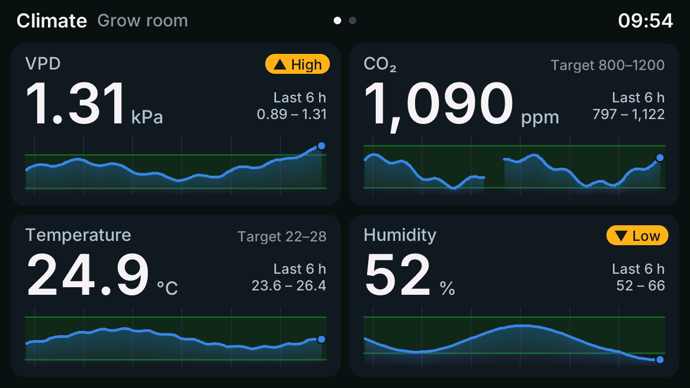
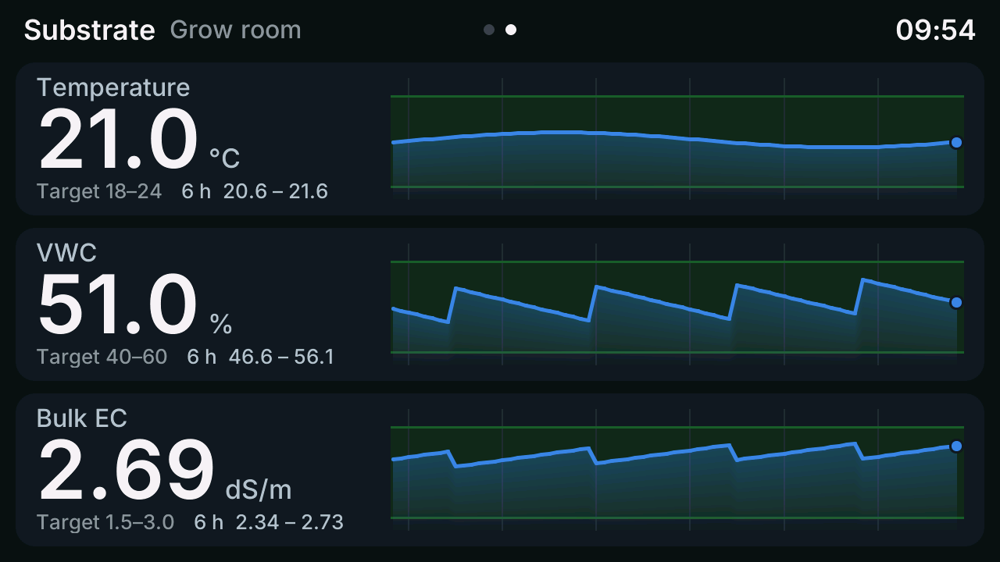

# Tab5 grow dashboard

An [ESPHome](https://esphome.io) dashboard for the [M5Stack Tab5](https://shop.m5stack.com/products/m5stack-tab5-iot-development-kit-esp32-p4)
that shows grow-room conditions from Home Assistant, each value with a 6-hour chart.

- **Climate** screen: VPD, CO₂, temperature and humidity. **Substrate** screen: temperature, VWC and bulk EC.
- Every tile has a 6-hour chart with your target range as a green band. Outside the range the tile shows an amber
  **▲ High** or **▼ Low** badge.
- The charts are filled from Home Assistant's statistics at boot, so they're complete straight after a reboot or update.
- Swipe between the screens. Left alone, they swap every 30 seconds.
- The header shows the time and an **HA offline** badge whenever Home Assistant is disconnected.

> [!NOTE]
> Status: the configuration validates and compiles for the ESP32-P4 on ESPHome 2026.9, and the screenshots above
> were rendered from it with synthetic data. It hasn't been run on a Tab5 yet; that's the next step before 1.0.

## What you need

- An M5Stack Tab5 with the ST7121 or ST7123 display controller (later production units). The original
  ILI9881C/GT911 revision isn't supported yet.
- ESPHome 2026.8 or newer.
- Home Assistant with the sensors you want to show.

## Install

1. In the ESPHome dashboard, create a new device for the Tab5 (or open its existing YAML) and paste in
   [`example.yaml`](example.yaml). Keep the `wifi`, `api` and `ota` blocks ESPHome generated for your device.
2. Point the `*_entity` lines at your Home Assistant sensors, and set the target ranges.
3. In Home Assistant, go to **Settings → Devices & services → ESPHome**, open the Tab5's **Configure** dialog and turn
   on **Allow the device to perform Home Assistant actions**. The Tab5 uses this to fetch the chart history.
4. Install. The first install has to be over USB-C; after that it updates over Wi-Fi.

ESPHome downloads the rest ([`dashboard.yaml`](dashboard.yaml) and the C++ helpers in
[`components/grow_dashboard`](components/grow_dashboard)) from this repository when it compiles.

## Settings

Set any of these under `substitutions:` in your device YAML. The defaults are at the top of
[`dashboard.yaml`](dashboard.yaml).

| Substitution | Default | What it does |
| --- | --- | --- |
| `name`, `friendly_name` | `m5stack-tab5`, `M5Stack Tab5` | Device name in ESPHome and Home Assistant |
| `room_name` | `Grow room` | Shown in the header |
| `dashboard_ref` | `main` | Release of this repo to use; see [Updating](#updating) |
| `display_model` | `M5STACK-TAB5-ST7121` | `M5STACK-TAB5-ST7123` if your panel has that controller |
| `rotation` | `90` | `270` if the picture is upside down for the way it's mounted |
| `cycle_interval`, `cycle_pause` | `30s`, `3min` | How often the screens swap, once nobody has touched them for `cycle_pause` |
| `<tile>_entity` | | The Home Assistant sensor for the tile |
| `<tile>_unit` | | Unit shown next to the value (display only) |
| `<tile>_decimals` | | Decimal places |
| `<tile>_low`, `<tile>_high` | | Target range |

`<tile>` is one of `vpd`, `co2`, `temp`, `humidity`, `substrate_temp`, `vwc` or `bulk_ec`.

## How the charts get their history

Each chart holds 72 five-minute averages, lined up with the 5-minute statistics Home Assistant keeps for every
sensor that has a `state_class`. When the Tab5 connects, it calls `recorder.get_statistics` for the last 6 hours,
and a response template trims Home Assistant's reply to about 8 KB of numbers before it's sent. After that the Tab5
samples each sensor every 10 seconds while Home Assistant is connected. If the connection drops, the missing
stretch is fetched again at the next time sync, every 15 minutes.

A sensor's chart only fills in from history if Home Assistant keeps statistics for it. Most sensors do; a template
sensor or helper (VPD is often one) may need its **State class** set to **Measurement**.

## Troubleshooting

- **Charts are empty after every restart, and the log says Home Assistant did not answer the last 3 history
  requests**: the setting in step 3 is off. Turn it on, then restart the Tab5.
- **One chart stays empty after a restart while the others fill in**: that sensor has no statistics in Home Assistant;
  see the paragraph above. The chart still fills from live readings.
- **The picture is upside down**: set `rotation: "270"`.

## Updating

Set `dashboard_ref` to a newer [release](https://github.com/Chill-Division/tab5-grow-dashboard/tags) and install
again. The dashboard and its C++ helpers both follow that one setting, so they always match.

## Credits

The board setup comes from the Tab5 page in [Chill-Division/M5Stack-ESPHome](https://github.com/Chill-Division/M5Stack-ESPHome).
Licensed under the Apache License 2.0.
